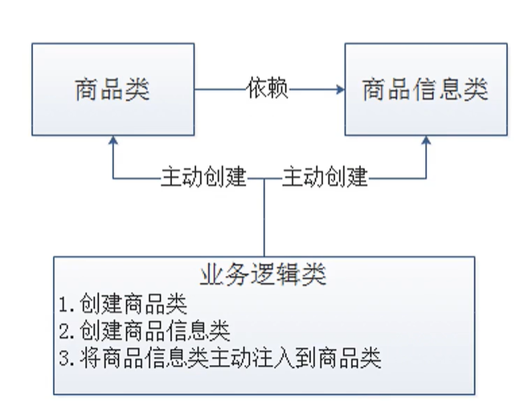

# Spring框架的学习 

> 名词解释：
>
> dao层：存放数据访问对象(Data Access Object)，数据访问对象。
>
> service层：某些操作依赖于dao层，将操作后的结果在返回出去给View层根据结果展现视图效果。
>
>

### 一、Spring框架的优点

<ol>
    <li>非侵入式框架，Spring框架的api不会出现在业务逻辑，也就是service层里。</li>
    <li>耦合性降低了，所有对象的创建和依赖都交给了一个Spring容器处理，组件之间分开了，没那么粘合。</li>
    <li>支持aop编程，将一些通用的任务，如安全，事务（数据库）和日志等，一起集中处理，减少通过传统oop方法（Object Oriented Programming面向对象程序设计方法）带来的代码冗余。</li>
    <li>支持声明式事务，通过Spring配置文件的方式管理数据库的事务，减少代码量。</li>
    <li>支持单元测试junit</li>
    <li>能够集成其他的框架，如Struts、MyBatis等等（依赖于Ioc< 控制反转Inversion of control >思想）</li>
    <li>封装好了很多的api无需造轮子，降低了JavaEEApi的使用难度</li>
</ol>  

### 二、控制反转（Inversion of control，简称Ioc）

> #### 传统面向对象创建程序图
>> 由应用程序主动去创建，赋值和销毁对象，商品信息类设计setter方法注入信息至商品类

 

> #### 利用控制反转机制改进后的面向对象创建程序图
>> 1、应用程序变得不是自己去主动操作对象，而是通过IoC容器去获取对象进行业务操作，对象的生命周期全权由IoC容器处理。 
> > 2、这是从IoC的角度来说，IoC容器控制应用程序，由IoC容器反向地向**应用程序**注入**应用程序**所需要的外部资源（外部实例对象、外部文件对象）。

### 三、bean的实例化

###### 方式一：构造方法实例化bean(默认创建出来的是单例的)（常用）

> 创建类后，声明一个带参构造方法，在Spring配置文件里通过 `<bean>`标签，声明好他的唯一标识并指向类所在位置后，再通过 `<constructor-arg>`标签进行赋值。
>
> 也可以是无参的，在对应实现类写一个无参构造，然后让他打印一句话，就能证实无参构造的方式也是可以的，更加常用的是这种，而且不必显式的写出，不写也可以。（具体见BookDaoImpl）
>
> `<bean>`标签
> <ol>
>   <li>id：唯一标识，是ApplicationContext内的getBean方法所需要传的第一个参数</li>
>   <li>name：别名，给id起别名，同样适用于传参</li>
>   <li>class：表明类的位置</li>
>   <li>scope：控制创造出来的bean是不是单例，也就说是不是同一个对象，singleton单例，prototype非单例，通过内存地址来判断的</li>
> </ol>

###### 方式二：使用静态工厂实例化bean（了解）

> 在factory包下创建dao层类的factory，实现一个返回dao层对象的静态方法，在配置文件实例化时传入的应该是工厂的静态方法
>
> `<bean>`标签
> <ol>
>   <li>factory-method：传入静态工厂的静态方法。</li>
> </ol>

###### 方式三：使用实例工厂实例化bean(默认创建出来的对象是单例的)（了解）

> 在factory包下创建dao层类的factory，实现一个返回dao层对象的方法，由于工厂里的方法不能够直接调用，new操作也只能交给Spring去处理。
>
> 因此需要我们在配置文件里`<bean>`一下工厂类，然后再`<bean>`一下dao层的类，传入工厂类唯一标识，调用工厂里的方法，这样实例工厂就建立好了。
>
> `<bean>`标签
> <ol>
>   <li>factory-method：传入实例工厂的方法。</li>
>   <li>factory-bean：传入实例工厂的唯一标识。</li>
> </ol>

###### 方式四：使用FactoryBean实例化bean(默认创建出来的对象是单例的)（使用）

> 减少了方式三中创建多余的无用的bean,简化了配置文件的代码量.
>
> 如何实现非单例呢?（一般不用，用单例居多，节省资源）
>
> 在FactoryBean里实现多一个方法isSingleton(),让其返回false即可.

### 四、bean的生命周期

> 如何配置bean的生命周期
>
> `<bean>`标签：init-method和destroy-method
>
> 在dao对应的实现类各写一个初始化方法和销毁方法，不带返回值且要public的。
>
> **注意**，测试时由于程序运行在jvm里，jvm退出时bean没来的急销毁，因此我们要用ApplicationContext的实现类ClassPathXmlApplicationContext，把这个io流关掉，这样销毁操作就会在流关掉之前执行了。
>
> 1、除了上面一种close方法关闭体现生命周期外，我们还可以用registerShutdownHook方法，告诉jvm在jvm退出之前，先把我们的容器关闭了再退出，相较于上面那种用法，这种方法温和些，温和体现在使用该方法bean先会被实例化放在容器里，而close不会。
>
> 2、除了两种自定义方法，spring还为我们提供了他们标准初始化销毁流程，在对应实现类实现两个接口，一个是InitializingBean和DisposableBean，实现他的两个方法。
>
> 3、标准初始中的afterPropertiesSet方法中有个细节，根据方法的表面直译，在属性设置好之后，也就是说我们通过setter方法注入的方式时，spring先把成员变量（也就是属性）设置好，再而进行初始化。

### 五、依赖注入（Dependency Inject）

#### 依赖注入的手动方式

> 是从应用程序的角度来看，IoC容器在运行的过程中，动态的将某种资源注入对象之中，无需实例化，例如只要声明一个setter方法，就可以对成员变量赋值，还可以使用动态代理过来的类的方法。
>
> 依赖注入的基本思想是：明确地定义各个接口，独立开放每个组件，并根据依赖关系进行组装！
>
> 1、setter注入，在bean中定义引用类型属性并提供可访问的setter方法，
>
> （1）配置中使用property标签的ref属性注入引用类型。
>
> （2）配置中使用property标签的value属性注入基本类型
>
> 2、构造方法注入
>
> （1）给配置文件的constructor-arg标签name传值的时候，注意是传入形参而不是属性值（成员变量），引用类型就用ref，基本类型就用value。
>
> （2）type类型就是各个形参的类型，如果遇到相同的就按顺序赋值。（解决了这里高耦合的问题，因为给name传值的时候必须要跟构造方法的形参一模一样）
>
> （3）index类型就是从零开始，形参的顺序按顺序赋值。
>
> 3、那什么时候用setter注入，什么时候用构造器注入呢？
> <ol>
>    <li>强制依赖（需要他的参数一定要不为空）使用构造器进行，使用setter注入有概率不进行注入导致null对象出现</li>
>    <li>可选依赖使用setter注入进行，灵活性强，自己开发的项目可以选用这个</li>
>    <li>一般只选择一种方式注入，多数情况下用setter注入</li>   
> </ol>

#### 依赖注入的自动方式
> （1）按类型，在`bean`标签写入autowire，参数是byType，要注意的是使用自动装配。
> 
> （2）按名称，`bean`autowire参数是byName，根据的是实现类的setter方法，去掉set后的名称找寻容器里的资源，一定要注意命名规范。
> 
> （3）按构造方法（不推荐用）
> 
> **注意**
> 
> （1）自动装配用于引用类型依赖注入，不能对简单类型进行操作，int类型的bean能写，但是不好。
> 
> （2）使用按类型装配时( byType )必须保障容器中相同类型的bean唯一，推荐使用
> 
> （3）使用按名称装配时( byName )必须保障容器中具有指定名称的bean，因变量名与配置耦合，不推荐使用
> 
> （4）自动装配优先级低于setter注入与构造器注入，同时出现时自动装配配置失效

#### 集合类型的依赖注入
> propertiy写好属性名后（注意命名规范，因为是通过setter方法切割set过来的名字），在他的子标签下写对应类型即可
